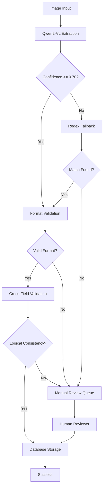

# Receipt Field Extraction Strategy

## Overview
This document defines the comprehensive strategy for extracting structured data from receipt/invoice images using the Qwen2-VL-7B-Instruct vision-language model, with regex-based fallback mechanisms.

## 1. Extraction Order and Dependencies

### Primary Extraction Order
The extraction follows a dependency-aware sequence:

```
1. Document Type Identification (receipt/invoice/claim form)
   └─> 2. Policy Number (highest priority - validates document relevance)
       └─> 3. Invoice Number (unique identifier)
           ├─> 4. Event Date (chronologically first)
           │   └─> 5. Submission Date (must be >= event_date)
           └─> 6. Claim Amount (totals validation)
```

### Dependency Rules
- **submission_date** MUST be >= **event_date**
- **event_date** MUST be in the past (not future)
- **claim_amount** should reconcile with itemized amounts if present
- **policy_number** should be validated against policy database
- **invoice_number** must be unique per submission

## 2. Validation Rules Per Field

### 2.1 Event Date (`event_date`)
**Format**: ISO-8601 (YYYY-MM-DD)

**Validation Rules**:
- Must be a valid calendar date
- Cannot be in the future
- Cannot be more than 5 years in the past (configurable)
- Must be <= submission_date

**Common Formats in Images**:
- `03/15/2024` → `2024-03-15`
- `15-Mar-2024` → `2024-03-15`
- `March 15, 2024` → `2024-03-15`
- `15.03.2024` (European) → `2024-03-15`

**Extraction Strategy**:
1. Look for labels: "Date of Service", "Service Date", "Event Date", "Date"
2. Parse multiple date formats using dateutil/arrow libraries
3. Prioritize dates in the main body over headers/footers
4. Confidence Score: High (>0.9) if near standard labels, Medium (0.7-0.9) if inferred

### 2.2 Submission Date (`submission_date`)
**Format**: ISO-8601 (YYYY-MM-DD)

**Validation Rules**:
- Must be >= event_date
- Cannot be in the future
- Typically within 30-365 days of event_date
- Must be a valid calendar date

**Common Formats**:
- "Claim Date", "Submission Date", "Filed Date", "Invoice Date"
- Often printed near the top of the document

**Extraction Strategy**:
1. Look for "Claim Date", "Submission", "Filed", "Invoice Date"
2. If not found, use document creation metadata (if available)
3. Fallback: current date (low confidence score)
4. Cross-validate with event_date constraint

### 2.3 Claim Amount (`claim_amount`)
**Format**: Object with `{value: float, currency: string, formatted: string}`

**Validation Rules**:
- value >= 0.01 (minimum claim)
- value <= 100,000 (configurable max for fraud detection)
- Exactly 2 decimal places
- Currency must be valid ISO-4217 code
- Should match sum of itemized amounts if present

**Common Formats**:
- `$125.50` → `{value: 125.50, currency: "USD"}`
- `EUR 1,500.00` → `{value: 1500.00, currency: "EUR"}`
- `£89.99` → `{value: 89.99, currency: "GBP"}`
- `1.234,56 €` (European) → `{value: 1234.56, currency: "EUR"}`

**Extraction Strategy**:
1. Look for: "Total", "Amount Due", "Claim Amount", "Total Due", "Balance"
2. Extract currency symbol or code (default: USD)
3. Parse number format (handle commas, periods based on locale)
4. Validate against itemized subtotals if present
5. Confidence High (>0.9) if labeled "Total", Medium if inferred

### 2.4 Invoice Number (`invoice_number`)
**Format**: Alphanumeric string with hyphens/slashes

**Validation Rules**:
- Length: 3-50 characters
- Pattern: `^[A-Z0-9\-\/]+$`
- Normalized: uppercase, spaces removed
- Must be unique in database

**Common Formats**:
- `INV-2024-001234`
- `INVOICE #A123456`
- `RCT/2024/5678`
- `Receipt No: 987654`

**Extraction Strategy**:
1. Look for labels: "Invoice #", "Invoice No", "Receipt #", "Reference", "Doc #"
2. Extract alphanumeric sequence after label
3. Normalize: uppercase, remove spaces, standardize separators
4. Validate uniqueness in database
5. Confidence High (>0.9) if labeled, Low (<0.7) if inferred from position

### 2.5 Policy Number (`policy_number`)
**Format**: Alphanumeric string with hyphens

**Validation Rules**:
- Length: 5-30 characters
- Pattern: `^[A-Z0-9\-]+$`
- Normalized: uppercase, spaces removed
- Must exist in policy database (critical validation)

**Common Formats**:
- `POL-2024-ABC123`
- `Policy: P123456789`
- `Insurance #: INS-A1B2C3D4`
- `Member ID: M987654321`

**Extraction Strategy**:
1. Look for: "Policy Number", "Policy #", "Member ID", "Insurance #", "Policy No"
2. Extract alphanumeric sequence
3. Normalize and validate against policy database
4. **Critical**: If not found or invalid → flag for manual review
5. Confidence High (>0.9) if validated in DB, else requires manual review

## 3. Confidence Scoring Methodology

### Confidence Score Calculation
Each field receives a confidence score (0.0 - 1.0) based on:

```python
confidence_score = (
    label_proximity_score * 0.40 +      # How close to expected label
    format_validation_score * 0.30 +    # Format correctness
    context_coherence_score * 0.20 +    # Relationship to other fields
    ocr_quality_score * 0.10            # Image/text quality
)
```

### Score Thresholds
- **High Confidence**: >= 0.90 → Auto-accept
- **Medium Confidence**: 0.70 - 0.89 → Accept with validation
- **Low Confidence**: 0.50 - 0.69 → Flag for review
- **Very Low**: < 0.50 → Require manual review

### Overall Document Score
```python
overall_confidence = min(
    average(all_field_scores),
    min(critical_field_scores)  # policy_number, invoice_number
)
```

If `overall_confidence < 0.70` → Route to manual review queue

## 4. Fallback Strategies When AI Fails

### Fallback Hierarchy
```
1. Qwen2-VL-7B Primary Extraction
   ↓ (confidence < 0.70)
2. Regex Pattern Matching
   ↓ (no match)
3. Alternative Qwen Prompt (rephrased)
   ↓ (still fails)
4. OCR + Rule-Based Heuristics
   ↓ (fails)
5. Manual Review Queue
```

### Regex Fallback Patterns

```python
REGEX_PATTERNS = {
    "event_date": [
        r"\b(\d{1,2}[\/\-\.]\d{1,2}[\/\-\.]\d{2,4})\b",  # MM/DD/YYYY
        r"\b(\d{4}[\/\-\.]\d{1,2}[\/\-\.]\d{1,2})\b",    # YYYY-MM-DD
        r"\b(\d{1,2}\s+(?:Jan|Feb|Mar|Apr|May|Jun|Jul|Aug|Sep|Oct|Nov|Dec)[a-z]*\s+\d{4})\b"
    ],
    "claim_amount": [
        r"(?:Total|Amount|Due)[:\s]*[\$€£]?\s*([\d,]+\.\d{2})",
        r"[\$€£]\s*([\d,]+\.\d{2})",
        r"([\d,]+\.\d{2})\s*(?:USD|EUR|GBP|CAD)"
    ],
    "invoice_number": [
        r"(?:Invoice|Receipt|Claim)\s*#?\s*:?\s*([A-Z0-9\-\/]+)",
        r"(?:Inv|Rct|Ref)\s*[#:]?\s*([A-Z0-9\-\/]+)"
    ],
    "policy_number": [
        r"(?:Policy|Member|Insurance)\s*#?\s*:?\s*([A-Z0-9\-]+)",
        r"(?:Pol|ID)\s*[#:]?\s*([A-Z0-9\-]+)"
    ]
}
```

### Alternative Prompt Strategy
If primary extraction fails, use simplified prompts:
- "What is the total amount shown on this receipt?"
- "Find the policy number or member ID"
- "When did this service occur?"

### Rule-Based Heuristics
- **Dates**: Assume date closest to "Date of Service" label
- **Amounts**: Largest monetary value in bold/prominent position
- **Numbers**: Longest alphanumeric sequence near "Invoice" label

## 5. Edge Cases and Error Handling

### Edge Case Matrix

| Edge Case | Detection | Handling Strategy |
|-----------|-----------|-------------------|
| **Multiple dates on document** | Count date occurrences | Prioritize by label proximity, select earliest for event_date |
| **Multiple currency amounts** | Multiple currency symbols | Extract all, select by label ("Total", "Amount Due") |
| **Handwritten receipts** | Low OCR confidence | Route to manual review, apply heavier preprocessing |
| **Partial/torn documents** | Missing expected fields | Flag incomplete, request rescan if possible |
| **Non-English receipts** | Language detection | Use multilingual OCR, translate labels |
| **Duplicate invoice numbers** | DB uniqueness check | Flag potential duplicate submission |
| **Future dates** | Date validation | Reject and request correction |
| **Extreme amounts** | Range validation | Flag outliers (< $1 or > $100K) for review |
| **Missing policy number** | Empty field after all attempts | **Critical failure** - cannot process without policy # |
| **Ambiguous amounts** | Multiple large numbers | Extract all candidates, flag for manual selection |
| **Scanned faxes/poor quality** | Low image quality score | Apply image enhancement, may require manual review |

### Critical Error Handling

```python
class ExtractionError(Exception):
    MISSING_POLICY_NUMBER = "Cannot process without valid policy number"
    INVALID_DATE_SEQUENCE = "Submission date before event date"
    AMOUNT_VALIDATION_FAILED = "Amount mismatch with itemized totals"
    FORMAT_VIOLATION = "Field format does not match schema"
    DUPLICATE_INVOICE = "Invoice number already exists in database"
```

### Handling Strategy by Severity
- **Critical** (policy_number missing): Reject submission, request resubmit
- **High** (date logic error): Auto-correct if possible, else manual review
- **Medium** (format issues): Normalize and accept with warning
- **Low** (confidence < 0.9): Accept but log for quality monitoring

## 6. Quality Assurance Workflow



## 7. Performance Monitoring

### Key Metrics to Track
- **Field-level accuracy**: % correct per field type
- **Overall extraction success rate**: Documents fully extracted
- **Confidence score distribution**: Monitor score trends
- **Fallback usage rate**: How often regex is needed
- **Manual review rate**: % requiring human intervention
- **Processing latency**: Time per document (target: < 3s)
- **Error type distribution**: Categorize failure modes

### Success Criteria (from requirements)
- **Accuracy**: >= 95% for all fields
- **Latency**: < 3 seconds per document
- **Manual Review Rate**: < 10% of submissions
- **Confidence Threshold**: 70% overall

## 8. Integration Points

### Pre-Processing Pipeline
1. Image quality check (resolution, brightness, orientation)
2. Image enhancement if needed (contrast, deskew, denoise)
3. Document type classification
4. ROI detection (focus on relevant regions)

### Post-Processing Pipeline
1. Schema validation (JSON Schema validation)
2. Business logic validation (date ranges, amounts, etc.)
3. Database uniqueness checks
4. Confidence score calculation
5. Manual review routing if needed
6. Audit log creation

### API Contract
```json
{
  "input": {
    "image_path": "string",
    "image_base64": "string (optional)",
    "validation_level": "strict|moderate|permissive"
  },
  "output": {
    "status": "success|partial|failure",
    "data": { /* extracted fields per schema */ },
    "metadata": {
      "confidence_scores": { /* per field */ },
      "extraction_method": "qwen_vl|regex_fallback|manual_review",
      "requires_manual_review": "boolean",
      "processing_time_ms": "number"
    },
    "errors": [ /* if any */ ]
  }
}
```

---

## Summary

This extraction strategy provides:
- ✅ Dependency-aware extraction order
- ✅ Comprehensive validation rules per field
- ✅ Multi-level confidence scoring
- ✅ Robust fallback mechanisms
- ✅ Detailed edge case handling
- ✅ Quality assurance workflow
- ✅ Performance monitoring framework

The strategy ensures >= 95% accuracy through layered validation and intelligent fallback, while maintaining sub-3-second latency targets.
